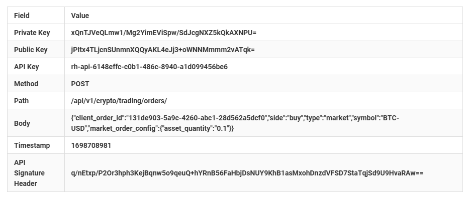

# Robinhood Bitcoin Trades
A sample buying and selling automation using python 

Project file structure
    ---- Working directory
        robin-roku-app = source code for your Roku TV
        robin-web-app = source code for connecting your Robinhood API keys

languages
    --- Brighterscript and Brightscript
    --- Python3

Read Rate Limiting documentation for the API
https://docs.robinhood.com/crypto/trading/

Request per minute per user account : 100
Request per minute per user account in bursts: 300

Please store tokes safely when testing and always keep them in a secrets.env file in the project.  

https://www.iana.org/protocols

Create a new secrets.env file and paste in your API Account into the file and save in the directory "robin-web-app\app\config\"
ROBINHOOD_API_KEY = "your key"
BASE64_PRIVATE_KEY = "your key"
ROBINHOOD_API_KEY_TEST = "your key"
BASE64_PRIVATE_KEY_TEST = "your key"
BASE64_PRIVATE_KEY_ORIG = "your key"
PUBLIC_KEY_BASE64 = "your key"
PRIVATE_KEY_BASE64_4_20_2025 = "your key"
PUBLIC_KEY_BASE64_4_20_202 = "your key"
API_KEY_REAL = "your key"

paste int the code with "your info" 

https://www.iana.org/numbers

Body =	{
    "client_order_id":"131de903-5a9c-4260-abc1-28d562a5dcf0",
    "side":"buy",
    "type":"market",
    "symbol":"BTC-USD",
    "market_order_config": {"asset_quantity":"0.1"}
}

body = {
    "client_order_id": "131de903-5a9c-4260-abc1-28d562a5dcf0",
    "side": "buy",
    "symbol": "BTC-USD",
    "type": "market",
    "market_order_config": {"asset_quantity": "0.1"}
}

